[English](./README.md) | 简体中文

# huaweicloud-iot-device-sdk-go

# 0.版本更新说明
| 版本     |变更类型| 说明                                               |
|:-------|:-|:-------------------------------------------------|
| v1.0.0 |新增功能| 提供对接华为云IoT物联网平台能力，方便用户实现安全接入、设备管理、数据采集、命令下发、设备发放、端侧规则等业务场景                         |   

# 1.前言
huaweicloud-iot-device-sdk-go提供设备接入华为云IoT物联网平台的Go版本的SDK，提供设备和平台之间通讯能力，以及设备服务、网关服务、OTA等高级服务，并且针对各种场景提供了丰富的demo代码。IoT设备开发者使用SDK可以大大简化开发复杂度，快速的接入平台。

本文通过实例讲述SDK帮助设备用MQTT协议快速连接到华为物联网平台。

华为云官网：https://www.huaweicloud.com/

点击华为云官网右上角“控制台”进入管理控制台，在页面上方搜索“IoTDA”进入设备接入服务控制台。

# 2.SDK简介
## 2.1 SDK功能简介
SDK面向运算、存储能力较强的嵌入式终端设备，开发者通过调用SDK接口，便可实现设备与物联网平台的上下行通讯。SDK当前支持的功能有：
*  支持设备消息、属性上报、属性读写、命令下发
*  支持OTA升级
*  支持密码认证和证书认证两种设备认证方式
*  支持设备影子查询
*  支持网关与子设备管理
*  支持自定义topic
*  支持文件上传/下载
*  支持端侧规则
*  支持设备发放

## 2.2SDK目录结构
<table>
  <tr>
    <td>目录结构</td>
    <td>目录</td>
    <td>说明</td>
  </tr>
 <tr>
   <td rowspan=9>iot</td>
   <td> callback</td>
   <td> 客户端回调函数</td>
  </tr>
  <tr>
   <td>client</td>
   <td>设备客户端</td>
  </tr>
  <tr>
   <td>config</td>
   <td>客户端配置</td>
  </tr>
  <tr>
   <td>constants</td>
   <td>常量包</td>
  </tr>
  <tr>
   <td>device</td>
   <td>直连设备客户端</td>
  </tr>
  <tr>
   <td>file</td>
   <td>文件上传下载</td>
  </tr>
  <tr>
   <td>gateway</td>
   <td>网关设备客户端</td>
  </tr>
  <tr>
   <td>model</td>
   <td>结构体包</td>
  </tr>
  <tr>
   <td>rule</td>
   <td>端侧规则包</td>
  </tr>
<tr>
   <td rowspan=15>sample</td>
   <td> bs</td>
   <td> 设备发放demo</td>
  </tr>
  <tr>
   <td>command</td>
   <td>命令demo</td>
  </tr>
  <tr>
   <td>file</td>
   <td>文件上传下载demo</td>
  </tr>
  <tr>
   <td>device</td>
   <td>直连设备客户端</td>
  </tr>
  <tr>
   <td>file</td>
   <td>文件上传下载</td>
  </tr>
  <tr>
   <td>gateway</td>
   <td>网关设备客户端</td>
  </tr>
  <tr>
   <td>log</td>
   <td>设备日志demo</td>
  </tr>
  <tr>
   <td>message</td>
   <td>消息上报下发demo</td>
  </tr>
  <tr>
   <td>ota</td>
   <td>ota升级demo</td>
  </tr>
  <tr>
   <td>properties</td>
   <td>设备属性demo</td>
  </tr>
  <tr>
   <td>rule</td>
   <td>端侧规则demo</td>
  </tr>
  <tr>
   <td>test_model</td>
   <td>测试结构体</td>
  </tr>
  <tr>
   <td>test_util</td>
   <td>测试工具类</td>
  </tr>
  <tr>
   <td>test_sync</td>
   <td>时间同步demo</td>
  </tr>
</table>

# 3.准备工作
*  已安装go 3.18
*  已按照go.mod安装相关依赖

# 4.SDK功能
## 4.1 上传产品模型并注册设备
为了方便体验，我们提供了一个烟感的产品模型，烟感会上报烟雾值、温度、湿度、烟雾报警、还支持响铃报警命令。
以烟感例，体验消息上报、属性上报、命令响应等功能。

* 访问[设备接入服务](https://www.huaweicloud.com/product/iothub.html) ，单击“立即使用”进入设备接入控制台。

* 点击“接入信息”,查看MQTT设备接入地址并保存该地址。

   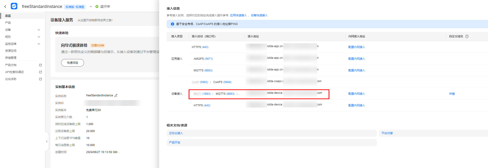


* 在设备接入控制台选择“产品”，单击右上角的”创建产品”，在弹出的页面中，填写“产品名称“、“协议类型”、“数据格式”、“厂商名称”、“所属行业”、“设备类型”等信息，然后点击右下角“立即创建”。

   - 协议类型选择“MQTT”；

   - 数据格式选择“JSON”。
 
   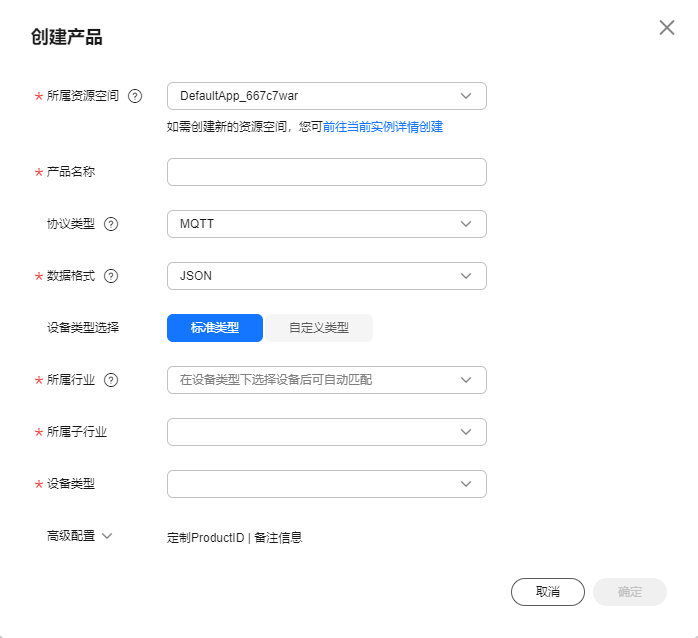

* 产品创建成功后，单击“详情”进入产品详情，在功能定义页面，单击“上传模型文件”，上传烟感产品模型[smokeDetector](https://iot-developer.obs.cn-north-4.myhuaweicloud.com/smokeDetector.zip) 。
    生成的产品模型如下图所示。

    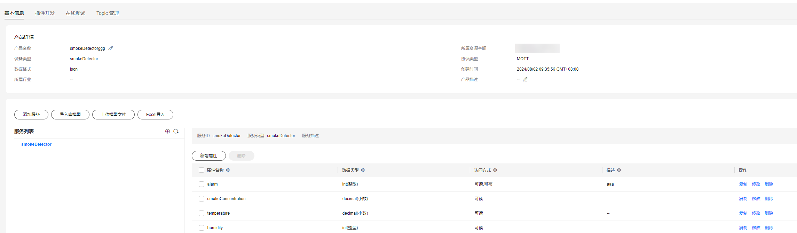

* 在左侧导航栏，选择“设备 > 所有设备”，单击右上角“注册设备”，在弹出的页面中，填写注册设备参数，然后单击“确定”。

   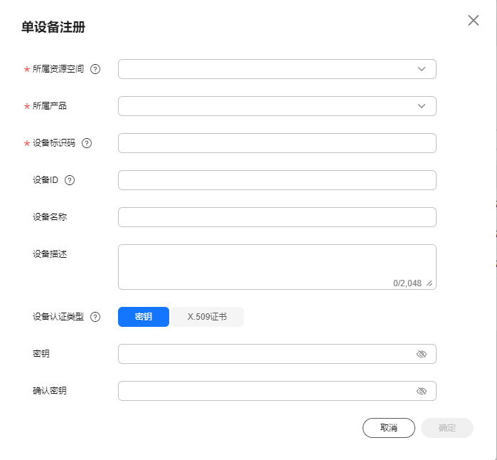

* 设备注册成功后保存设备标识码、设备ID、密钥。

## 4.2 在线调试工具
在控制台左侧导航栏，选择“监控运维 > 在线调试”可以进入在线调试页面。
页面中有命令下发、消息跟踪功能。

*  点击页面右上角的“选择设备”选择已注册的设备

*  点击“IoT平台”会显示消息跟踪

*  点击页面右下角的“发送”可以发送命令给设备


## 4.3 设备初始化

* 创建设备
* 创建设备。

   设备接入平台时，物联网平台提供密钥和证书两种鉴权方式。

   * 如果您使用1883端口通过密钥鉴权接入平台，需要写入获取的设备ID、密钥。

   ```go
    //创建一个设备并连接到平台
	authConfig := &config2.ConnectAuthConfig{
		Id:       "{your device id}",
		Servers:  "mqtt://{access_address}:1883",
		Password: "your device secret",
	}
	mqttDevice := device2.NewMqttDevice(authConfig)
   ```

   * 如果您使用8883端口通过密钥鉴权接入平台（推荐使用，SDK的demo均通过此方法接入平台），需要写入获取的设备ID、密钥以及预置CA证书。
   预置的证书：/samples/resources/root.pem
  
   ```go
    authConfig := &config.ConnectAuthConfig{
		Id:       "{your device id}",
		Servers:  "mqtts://{access_address}:8883",
		Password: "your device secret",
		ServerCaPath: "./resources/root.pem",
	}
	mqttDevice := device.NewMqttDevice(authConfig)
   ```
   * 如果您使用8883端口并通过X509证书鉴权接入平台，则需要写入获取的设备ID，证书信息以及预制CA证书。更多X509证书接入请参考[X509证书接入](https://support.huaweicloud.com/bestpractice-iothub/iot_bp_0077.html)
     预置的证书：/samples/resources/root.pem
   
    ```go
     authConfig := &config.ConnectAuthConfig{
		 Id:       "{your device id}",
		 Servers:  "mqtts://{access_address}:8883",
		 AuthType:        constants.AuthTypeX509,
		 ServerCaPath: "./resources/root.pem",
         CertFilePath: "your device cert path",
		 CertKeyFilePath: "your device cert key path",
	 }
	 mqttDevice := device.NewMqttDevice(authConfig)
    ```

* 调用connect接口，建立连接。该接口是阻塞调用，如果建立连接成功会返回true。

   ```go
        initResult := mqttDevice.Connect()
   ```

* 连接成功后，设备和平台之间开始通讯。通过MqttDevice的Client属性获取设备客户端，客户端提供了消息、属性、命令等通讯接口。
例如：
   ```go
        mqttDevice.Client.AddCommandHandler(func(command model.Command) (bool, interface{}) {
		    fmt.Println("I get command from platform")
		    return true, map[string]interface{}{
			    "cost_time": 12,
		    }
	    })
        mqttDevice.SendMessage(message)
   ```

*  关于MqttDevice类的详细信息参见iot/device/mqtt_device.go

若连接成功，在线调试页面的“消息跟踪”会显示：

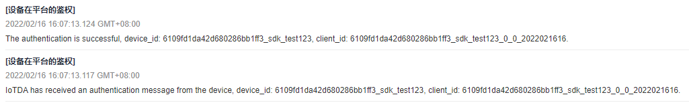

运行日志为：

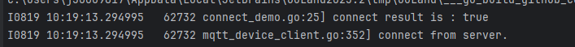


## 4.4 命令下发

/samples/command/platform_command.go是一个处理平台命令下发的例子。
设置命令监听器用来接收平台下发的命令，在回调接口里，将对命令进行处理，并上报响应。

下面代码的实现CommandHandler函数做为命令监听器，即：

```go
    mqttDevice.Client.AddCommandHandler(func(command model.Command) (bool, interface{}) {
		glog.Infof("I get command from platform")
		glog.Infof("command device id is %s", command.ObjectDeviceId)
		glog.Infof("command name is %s", command.CommandName)
		glog.Infof("command serviceId is %s", command.ServiceId)
		glog.Infof("command params is %v", command.Paras)
		return true, map[string]interface{}{
			"cost_time": 12,
		}
	})
```

当device收到命令时将自动调用CommandHandler函数。
例子在CommandHandler函数中打印命令的内容，并将响应返回给平台。

执行main方法，在“在线调试”页面给设备下发命令，代码会产生以下输出：

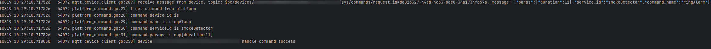

同时，设备对命令的响应可以在“在线调试”的“消息跟踪”处找到。

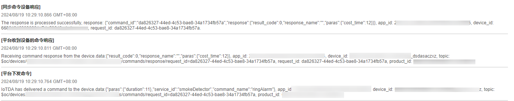


## 4.5 平台消息下发/设备消息上报
消息下发是指平台向设备下发消息。消息上报是指设备向平台上报消息。更多设备消息信息请参考[设备消息文档](https://support.huaweicloud.com/usermanual-iothub/iot_01_0322.html)

### 4.5.1 消息上报
/samples/message/message_demo.go是一个消息上报的例子。
```go
    """ create device code here """
    //向平台发送消息
    message := model.Message{
		Topic:   "{custom topic}",
		Payload: "first message",
	}

	for {
		sendMsgResult := device.SendMessage(message)
		glog.Infof("send message %v", sendMsgResult)
		time.Sleep(1 * time.Second)
	}
```
在上述代码中， 可以通过SendMessage方法将消息上报给自定义topic，也可以不在message中填写topic，则消息将会上报给平台的默认topic。若发送成功，在“在线调试”页面可以看到：

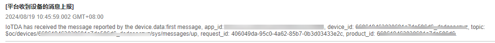

### 4.5.2 消息下发
/samples/message/message_demo.go是一个消息下发的例子。
```go
    < create device code here ... >

    // 注册平台下发消息的callback，当收到平台下发的消息时，调用此callback.
	// 支持注册多个callback，并且按照注册顺序调用
	device.Client.AddMessageHandler(func(message string) bool {
		glog.Infof("first callback called : %s", message)
		return true
	})
    // 可以在此处实现与平台建链后的一些自定义逻辑，比如建链后订阅一些自定义的topic
	device.Client.ConnectHandler = func(client mqtt.Client) {
		// 使用自定义topic接收平台下发的消息
		device.Client.SubscribeCustomizeTopic("testdevicetopic", func(message string) bool {
			glog.Infof("first callback called %s", message)
			return true
		})
	}
    device.Connect()

```

上面代码中ConnectHandler可以在平台建立链接后通过SubscribeCustomizeTopic订阅自定义topic下发的消息，若不使用自定义topic下发的消息，则通过AddMessageHandler方法接受平台默认topic下发消息。执行main函数后，您可以在平台使用消息下发，代码会产生以下输出：
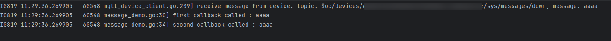

## 4.6 属性上报/设置
属性上报指的是设备将当前属性值上报给平台。属性设置指的是平台设置设备的属性值。
/samples/properties/device_properties.go是一个属性上报/设置的例子。
### 4.6.1 属性上报
用于设备按产品模型中定义的格式将属性数据上报给平台。平台会将上报的数据赋给设备影子数据。


   ```go
    < create device code here ... >
       // 设备上报属性
	props := model.DevicePropertyEntry{
		ServiceId: "smokeDetector",
		EventTime: iot.GetEventTimeStamp(),
		Properties: test_model.DemoProperties{
			Temperature: 28,
		},
	}

	var content []model.DevicePropertyEntry
	content = append(content, props)
	services := model.DeviceProperties{
		Services: content,
	}
	device.ReportProperties(services)
   ```

上面代码将上报temperature属性。
若上报成功，“在线调试”页面会显示：

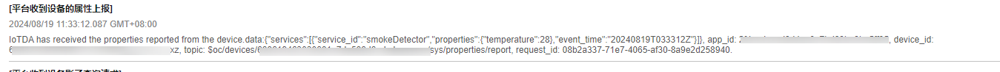

在左侧导航栏中选择“设备 > 所有设备”，选择注册的设备进行查看，在“设备影子”处可以看到刚刚上报的属性值。

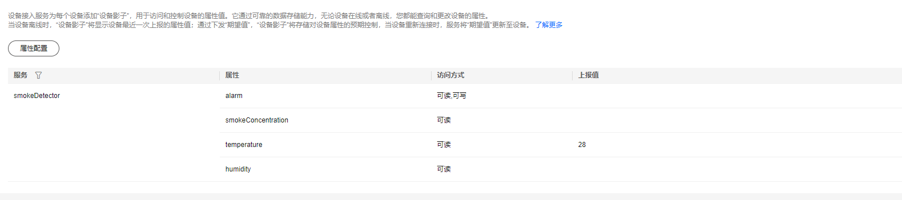

### 4.6.2 平台设置设备属性
若通过AddPropertiesSetHandler和SetPropertyQueryHandler方法为设备设置为属性监听器，即：

```go
// 注册平台设置属性callback,当应用通过API设置设备属性时，会调用此callback，支持注册多个callback
	device.Client.AddPropertiesSetHandler(func(propertiesSetRequest model.DevicePropertyDownRequest) bool {
		fmt.Println("I get property set command")
		fmt.Printf("request is %s", iot.Interface2JsonString(propertiesSetRequest))
		return true
	})
    // 注册平台查询设备属性callback，当平台查询设备属性时此callback被调用，仅支持设置一个callback
	device.Client.SetPropertyQueryHandler(func(query model.DevicePropertyQueryRequest) model.DevicePropertyEntry {
		return model.DevicePropertyEntry{
			ServiceId: "smokeDetector",
			Properties: test_model.DemoProperties{
				Temperature: 27,
			},
			EventTime: "2024-05-28 14:23:24",
		}
	})
```

那么当device收到属性读写请求时将自动调用监听器中的PropertiesSetHandler或PropertyQueryHandler方法。
其中PropertiesSetHandler方法处理写属性，PropertyQueryHandler方法处理读属性。
多数场景下，用户可以直接从平台读设备影子，因此PropertyQueryHandler方法不用实现。
但如果需要支持从设备实时读属性，则需要实现此方法。
例子在PropertiesSetHandler方法中打印属性设置的内容，并将响应返回给平台。

```go

def run():
    < create device code here ... >
    
    // 注册平台设置属性callback,当应用通过API设置设备属性时，会调用此callback，支持注册多个callback
	device.Client.AddPropertiesSetHandler(func(propertiesSetRequest model.DevicePropertyDownRequest) bool {
		glog.Infof("I get property set command")
		glog.Infof("request is %s", iot.Interface2JsonString(propertiesSetRequest))
		return true
	})
    device.Connect()
	glog.Infof("device connected: %v\n", device.IsConnected())

```

在“设备影子”处，点击“属性配置”可以设置属性的期望值。
若设置的期望值与设备的上报值不一样，在设备上线时，平台会自动把期望值发送给设备。（即平台设置设备属性）

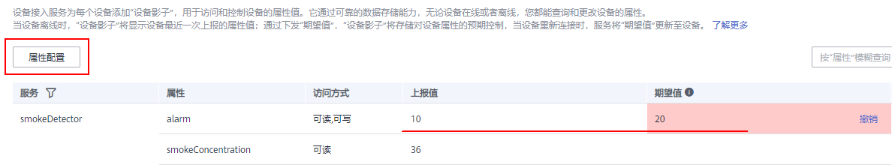

运行上面的run函数，得到：

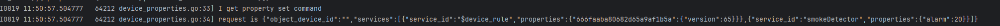

## 4.7 设备影子
用于设备向平台获取设备影子数据。设备可以获取到平台设备影子数据，以此来同步设备属性值，从而完成设备属性值的修改。

/samples/properties/device_properties.go中也包含设备获取平台设备影子数据。

* 设备请求获取平台的设备影子数据。

   ```go
    # 接收平台下行响应
    device.Client.AddDeviceShadowQueryResponseHandler(func(response model.DeviceShadowQueryResponse) {
		shadow := response.Shadow
		glog.Infof("receive shadow msg from device.")
		glog.Infof("on_shadow_get device_id:  %s", response.ObjectDeviceId)
		glog.Infof("shadow service_id: %s", shadow[0].ServiceId)
		glog.Infof("shadow desired properties: %v", shadow[0].Desired)
		glog.Infof("shadow reported: %v", shadow[0].Reported)
	})

    device.Connect()
	glog.Infof("device connected: %v\n", device.IsConnected())

    // 设备查询设备影子数据
	device.QueryDeviceShadow(model.DevicePropertyQueryRequest{
		ServiceId: "smokeDetector",
	})
   ```
## 4.8 OTA升级
在/samples/ota/ota_demo.go中实现了一个OTA升级的例子，如下面代码所示。

```go
   < create device code here ... >

    // OTA监听器设置，上报sdk版本号
    device.Client.SwFwVersionReporter = func() (string, string) {
		return "v1.0", "v1.0"
	}

	// 设置OTA升级回调函数进行升级 upgradeType 0： 软件升级 1： 固件升级
	device.Client.DeviceUpgradeHandler = func(upgradeType byte, info model.UpgradeInfo) model.UpgradeProgress {
		glog.Infof("begin to handle upgrade process")
		upgradeProcess := model.UpgradeProgress{}
		currentPath, err := os.Getwd()
		if err != nil {
			glog.Warningf("get executable path failed. err: %s", err.Error())
			upgradeProcess.ResultCode = 255
			upgradeProcess.Description = "get executable path failed."
			return upgradeProcess
		}
        // 软固件下载包保存路径
		currentPaths = currentPath + "\\download\\ota.txt"
		downloadFlag := file.CreateHttpClient().DownloadFile(currentPath, info.Url, info.AccessToken)
		if !downloadFlag {
			glog.Errorf("down load file { %s } failed", currentPath)
			upgradeProcess.ResultCode = 10
			upgradeProcess.Description = "down load ota package failed."
			return upgradeProcess
		}
		glog.Infof("download file success.")
		//checkPackage()  校验下载的升级包
		//installPackage()  安装升级包
		upgradeProcess.ResultCode = 0
		upgradeProcess.Version = info.Version
		upgradeProcess.Progress = 100
		return upgradeProcess
	}

    connect := device.Connect()
	glog.Infof("connect result : %v", connect)
```
用户需要实现的是DeviceUpgradeHandler监听器，本示例中是一个默认监听器实现的例子。

### 4.8.1 如何进行OTA升级

1. 固件升级。参考[固件升级](https://support.huaweicloud.com/usermanual-iothub/iot_01_0027.html)

2. 软件升级。参考[软件升级](https://support.huaweicloud.com/usermanual-iothub/iot_01_0047.html)

## 4.9 文件上传/下载
在/samples/file/upload_file.go中实现了一个文件上传/下载的例子。

```go
    < create device code here ... >
    
    fileName := "test_upload.txt"
	uploadFilePath := currentPath + "\\download\\test_upload.txt"
    // 上传文件
	device.UploadFile(fileName, uploadFilePath)

	time.Sleep(10 * time.Second)
    // 下载文件
	downloadFilePath := currentPath + "\\download\\test_download.txt"
	device.DownloadFile(fileName, downloadFilePath)
```

文件上传/下载流程参考[文件上传](https://support.huaweicloud.com/usermanual-iothub/iot_01_0033.html)

* 在控制台中配置OBS存储。
   
   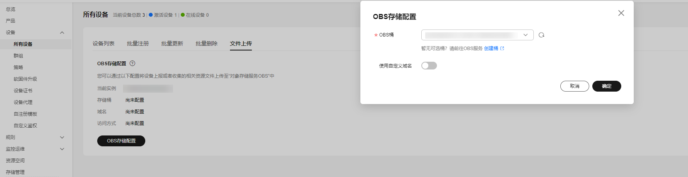

* 预置好上传文件。上面例子的待上传文件为/iot_device_demo/filemanage/download/upload_test.txt。
   文件下载部分将已上传的upload_test.txt下载下来保存到/iot_device_demo/filemanage/download/download.txt。

* 执行上面例子可到OBS上看到存储结果。
   
   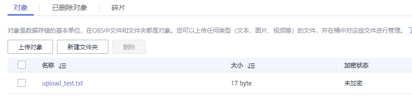

## 4.10 设备时间同步
在/samples/time_sync/time_sync_demo.go中实现了一个设备时间同步的例子。

```go
   < create device code here ... >

    // 设置时间同步服务 
    device.Client.SyncTimeResponseHandler = func(deviceSendTime, serverRecvTime, serverSendTime int64) {
		deviceRecvTime := time.Now().UnixNano() / int64(time.Millisecond)
		now := (serverRecvTime + serverSendTime + deviceRecvTime + deviceSendTime) / 2
		glog.Infof("now is %d", now)
	}

    connect := device.Connect()
	glog.Infof("connect result : %v", connect)

    # 请求时间同步
    sync := device.RequestTimeSync()
    glog.Infof("sync time result: %v", sync)
	time.Sleep(10 * time.Second)
```
用户可以自己实现SyncTimeResponseHandler方法。
/samples/time_sync/time_sync_demo.go中的SyncTimeResponseHandler方法是一个监听器实现的例子。假设设备收到的设备侧时间为device_recv_time，则设备计算自己的准确时间为：
(server_recv_time + server_send_time + device_recv_time - device_send_time) / 2

## 4.11 网关与子设备管理
此功能参考[网关与子设备](https://support.huaweicloud.com/usermanual-iothub/iot_01_0052.html)

网关与子设备管理的demo代码在/samples/gateway/gateway_demo.go下。此demo演示如何使用网关设备与平台进行通信。

此demo可以演示：
1. 网关同步子设备列表。网关设备不在线时，平台无法将子设备新增和删除的信息及时通知到网关设备。
2. 网关设备离线再上线时，平台会通知新增/删除的子设备信息。
3. 网关更新子设备状态。网关通知平台子设备的状态为“ONLINE“。
4. 子设备通过网关上报消息到平台。
5. 平台给子设备下发命令。
6. 网关新增/删除子设备请求

### 4.11.1 创建网关设备
* 与直连设备一致，可以使用8883端口用来接入平台
```go
    authConfig := &config.ConnectAuthConfig{
		Id:           "your device id",
		Servers:      "mqtts://{your access ip}:8883",
		Password:     "your device key",
		ServerCaPath: "./resources/root.pem",
	}
	mqttDevice := gateway.NewMqttGatewayDevice(authConfig)
	connect := mqttDevice.Connect()
	if !connect {
		return nil
	}
```
### 4.11.2 平台通知网关子设备增删
在samples/gateway/gateway_demo.go中，platformNotifySubDeviceAdd()和platformNotifySubDeviceDelete()方法演示了平台通知网关子设备增删功能
```go
    < create device code here ... >
    // 网关收到添加子设备的回调
	gatewayDevice.Client.SubDevicesAddHandler = func(devices model.SubDeviceInfo) {
		glog.Infof("sync sub device add version: %s", devices.Version)
		deviceList := devices.Devices
		for _, deviceInfo := range deviceList {
			glog.Infof("add sub device. deviceId : %s", deviceInfo.DeviceId)
		}
	}
    / 网关收到删除子设备的回调
	gatewayDevice.Client.SubDevicesDeleteHandler = func(devices model.SubDeviceInfo) {
		glog.Infof("sync sub device delete version: %s", devices.Version)
		deviceList := devices.Devices
		for _, deviceInfo := range deviceList {
			glog.Infof("delete sub device. deviceId : %s", deviceInfo.DeviceId)
		}
	}
```
用户可以自己实现SubDevicesAddHandler与SubDevicesDeleteHandler方法，本示例中提供一个默认实现，当平台创建删除子设备后，网关将收到一条通知，并将子设备信息打印出来。

### 4.11.3 网关同步子设备列表
在samples/gateway/gateway_demo.go中，syncSubDevices()方法演示了网关同步子设备列表功能
```go
    //  同步新增子设备响应
	gatewayDevice.Client.SubDevicesAddHandler = func(devices model.SubDeviceInfo) {
		glog.Infof("sync sub device add version: %s", devices.Version)
		deviceList := devices.Devices
		for _, deviceInfo := range deviceList {
			glog.Infof("add sub device. deviceId : %s", deviceInfo.DeviceId)
		}
	}
	// 同步删除子设备响应
	gatewayDevice.Client.SubDevicesDeleteHandler = func(devices model.SubDeviceInfo) {
		glog.Infof("sync sub device delete version: %s", devices.Version)
		deviceList := devices.Devices
		for _, deviceInfo := range deviceList {
			glog.Infof("delete sub device. deviceId : %s", deviceInfo.DeviceId)
		}
	}
    gatewayDevice.SyncAllVersionSubDevices()
```
用户可以自己实现SubDevicesAddHandler与SubDevicesDeleteHandler方法，本示例中提供一个默认实现，当设备发送同步子设备请求时，平台会将需要删除和添加的子设备信息发送给设备。

### 4.11.4 网关更新子设备状态
在samples/gateway/gateway_demo.go中，updateSubDeviceStats()方法演示了网关更新子设备状态功能
```go
// 更新子设备状态请求响应
	gatewayDevice.Client.SubDeviceStatusRespHandler = func(response model.SubDeviceStatusResp) {
		if len(response.SuccessfulDevices) > 0 {
			glog.Infof("success update device status.")
			for _, sucessDevice := range response.SuccessfulDevices {
				glog.Infof("update device : %s status: %s", sucessDevice.DeviceId, sucessDevice.Status)
			}
		}
		if len(response.FailedDevices) > 0 {
			glog.Infof("failed to update device status")
			for _, failedDevice := range response.FailedDevices {
				glog.Infof("failed to update device status. deviceId : %s, errCode: %s, errMsg: %s",
					failedDevice.DeviceId, failedDevice.ErrorCode, failedDevice.ErrorMsg)
			}
		}
	}
    status := model.DeviceStatus{
		DeviceId: "xxxx",
		Status:   "ONLINE",
	}
	statusInfos := make([]model.DeviceStatus, 1)
	statusInfos = append(statusInfos, status)
	subDeviceStatus := model.SubDevicesStatus{
		DeviceStatuses: statusInfos,
	}
    // 更新子设备状态
    gatewayDevice.UpdateSubDeviceState(subDeviceStatus)
```
用户可以自己实现SubDeviceStatusRespHandler方法，本示例中提供一个默认实现，网关发送更新子设备状态请求给平台后，平台收到请求更新设备状态后将会将成功设备和失败设备通知给网关。

### 4.11.5 网关添加子设备
在samples/gateway/gateway_demo.go中，gatewayAddSubDevice()方法演示了网关添加子设备功能
```go
    // 添加子设备请求响应
	gatewayDevice.Client.SubDevicesAddHandler = func(devices model.SubDeviceInfo) {
		glog.Infof("sub device add version: %s", devices.Version)
		deviceList := devices.Devices
		for _, deviceInfo := range deviceList {
			glog.Infof("add sub device. deviceId : %s", deviceInfo.DeviceId)
		}
	}
	deviceInfo := model.DeviceInfo{
		DeviceId:       "xxxxx",
		NodeId:         "xxxxxx",
		Name:           "xxxx",
		ParentDeviceId: "xxxxx",
		Description:    "xxxxx",
		ProductId:      "xxxxx",
	}
	infos := make([]model.DeviceInfo, 1)
	infos = append(infos, deviceInfo)
	gatewayDevice.AddSubDevices(infos)
```
用户可以自己实现SubDevicesAddHandler方法，本示例中提供一个默认实现，网关发送子设备添加请求给平台后，平台添加子设备后将会将通知网关子设备新增。

### 4.11.6 网关删除子设备
在samples/gateway/gateway_demo.go中，gatewayDeleteDevice()方法演示了网关删除子设备功能
```go
    // 删除子设备请求响应
	gatewayDevice.Client.SubDevicesDeleteHandler = func(devices model.SubDeviceInfo) {
		glog.Infof("sync sub device delete version: %s", devices.Version)
		deviceList := devices.Devices
		for _, deviceInfo := range deviceList {
			glog.Infof("delete sub device. deviceId : %s", deviceInfo.DeviceId)
		}
	}
	// 这里演示网关主动删除子设备请求
	deviceIds := make([]string, 1)
	deviceIds = append(deviceIds, "xxxxx")
	gatewayDevice.DeleteSubDevices(deviceIds)
```
用户可以自己实现SubDevicesDeleteHandler方法，本示例中提供一个默认实现，网关发送子设备删除请求给平台后，平台删除子设备后将会将通知网关子设备删除。

## 4.12 上报设备日志信息
在/samples/log/log_samples.go中，演示了设备上报日志信息。
```go
    < create device code here ... >

    for i := 0; i < 10; i++ {
		entry := model.DeviceLogEntry{
			Type: "DEVICE_MESSAGE",
			//Timestamp: iot.GetEventTimeStamp(),
			Content: "message hello " + strconv.Itoa(i),
		}
		entries = append(entries, entry)
	}

	for i := 0; i < 100; i++ {
		result := device.ReportLogs(entries)
		fmt.Println(result)

	}
```
用户可以根据需求，在设备的不同时期上报不同的日志信息，比如：设备断链重连后上报一条日志。

## 4.13 端侧规则
在控制台创建一个端侧规则:
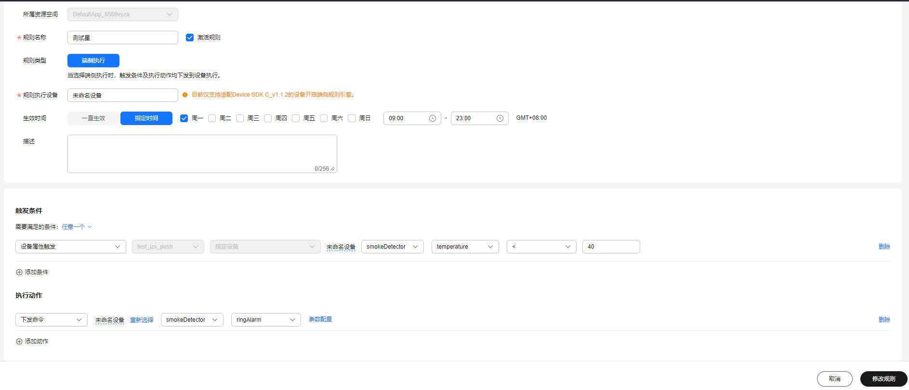

在/samples/rule/rule_demo.go中ruleManage()方法实现了一个端侧规则的例子。您可以通过以下参数开启端侧规则
```go
authConfig.RuleEnable = true
```
通过实现CommandHandler方法，设置设备命令监听器，即：

```go
device.Client.CommandHandler = func(command model.Command) (bool, interface{}) {
		glog.Infof("command device id is %s", command.ObjectDeviceId)
		glog.Infof("command name is %s", command.CommandName)
		glog.Infof("command serviceId is %s", command.ServiceId)
		glog.Infof("command params is %v", command.Paras)
		return true, map[string]interface{}{
			"cost_time": 12,
		}
	}
```

当规则触发时，device收到命令将自动调用监听器中方法。
例子在CommandHandler方法中打印命令的内容，客户可以自定义该内容来实现设备的一系列操作。

```python
def run():
    
    < create device code here ... >
    
    # 设置监听器
    device.Client.CommandHandler = func(command model.Command) (bool, interface{}) {
		glog.Infof("command device id is %s", command.ObjectDeviceId)
		glog.Infof("command name is %s", command.CommandName)
		glog.Infof("command serviceId is %s", command.ServiceId)
		glog.Infof("command params is %v", command.Paras)
		return true, map[string]interface{}{
			"cost_time": 12,
		}
	}
    
    connect := device.Connect()
	glog.Infof("connect result : %v", connect)

    // 上报SDK版本,端侧规则需要有sdk版本号才能创建
	device.ReportDeviceInfo("", "")

    logger.info("begin to report properties")
    //上报属性
	props := model.DevicePropertyEntry{
		ServiceId: "smokeDetector",
		EventTime: iot.GetEventTimeStamp(),
		Properties: test_model.DemoProperties{
			Temperature: 1,
		},
	}

	var content []model.DevicePropertyEntry
	content = append(content, props)
	services := model.DeviceProperties{
		Services: content,
	}
	device.ReportProperties(services)
	for {
		time.Sleep(1 * time.Second)
	}
```

执行run函数，代码会产生以下输出：
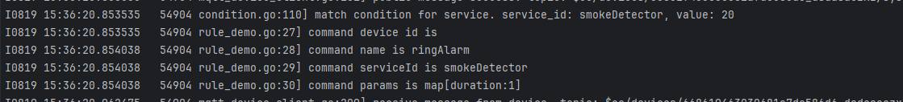

若想使用自定义方式对端侧规则的action进行处理，在/samples/rule/rule_demo.go中customRuleManage()实现了一个自定义端侧规则的例子。
下面代码的RuleActionHandler为一个自定义端侧规则处理方法，将RuleActionHandler的实例设置为命令监听器，即：

```go
device.Client.RuleActionHandler = func(actions []model.Action) bool {
		for _, action := range actions {
			glog.Infof("action deviceId: %s:", action.DeviceId)
			command := action.Command
			glog.Infof("action command name : %s", command.CommandName)
			glog.Infof("action command body : %v", command.CommandBody)
		}
		return true
	}
```

当规则触发时，device收到命令将自动调用监听器中的RuleActionHandler方法。
例子在RuleActionHandler方法中实现一些自定义操作。例如以下输出：
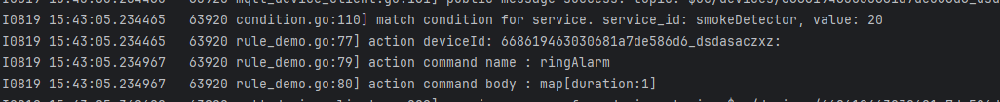

## 4.14 设备发放
在控制台创建一个发放策略，关键字为xxx:
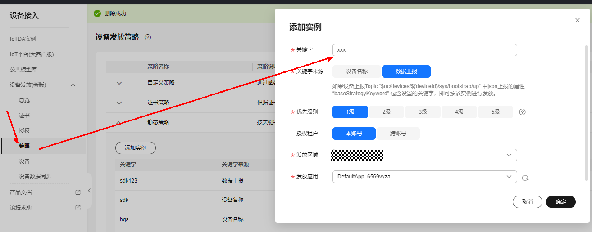

在控制台创建一个设备，策略类型选择静态策略，产品选择与创建的策略在同一区域内的：
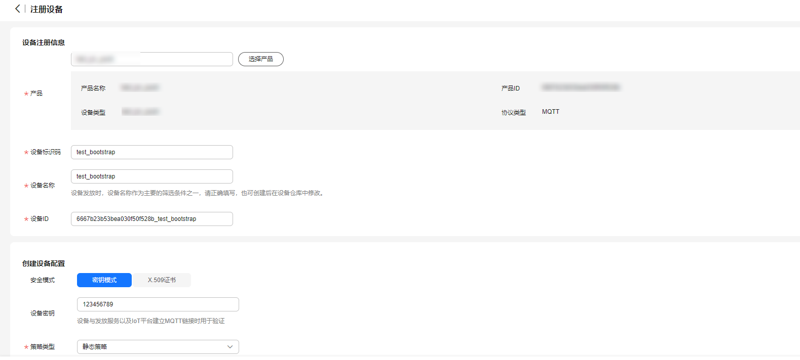

在/samples/bs/bootstrap_sample.go中bootstrapSecret()方法实现了一个使用静态策略发放设备的例子。将Servers修改为发放的地址，设备和密码选择刚刚创建的设备id和密码，
BootStrapBody中BaseStrategyKeyword的值xxx为创建的静态策略的关键字,填写正确的证书信息后。

```go
    // 发放平台注册的设备ID
	deviceId := "your device id"
	// 设备秘钥
	pwd := "your device password"

	authConfig := config2.ConnectAuthConfig{
		Id:             deviceId,
		Password:       pwd,
		Servers:        "mqtts://{bootstrap access ip}:8883",
		UseBootstrap:   true,
		BsServerCaPath: "./resource/root.pem",
		ServerCaPath:   "./resource/root.pem",
		BootStrapBody: &model.BootStrapProperties{
			BaseStrategyKeyword: "xxx",
		},
	}
	device := device2.NewMqttDevice(&authConfig)
	if device == nil {
		glog.Warningf("create device failed.")
		return
	}
	initRes := device.Connect()
	glog.Infof("connect result : %v", initRes)
	time.Sleep(3 * time.Second)
	// 上报属性
	device.ReportProperties(test_util.GeneratePropertiesMessage(28))
```
执行run函数，代码会产生以下输出：
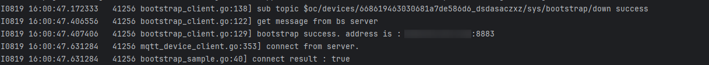

/samples/bs/bootstrap_sample.go中除了使用密钥认证设备发放的方法bootstrapSecret()，还有使用证书设备发放的方法bootstrapCert()，使用密钥认证设备组发放的方法bootstrapScopeIdSecretStaticPolicy()，以及使用证书认证注册组设备发放的方法bootstrapScopeIdCertStaticPolicy()。设备发放成功后，接入地址会存储在本地server_info.txt文件中，下次再执行则优先使用文件中的地址进行接入，若更新了设备密钥或使用其他设备进行发放，则需要删除该文件后再重新进行发放。使用静态策略进行注册组设备发放。详细参数可以参考以下链接：
[设备接入发放示例](https://support.huaweicloud.com/qs-iotps/iot_03_0006.html)

## 4.15 断链重连
在/samples/connect/connect_demo.go中connectWithRetry()方法， 我们展示了断线重连的功能。
```go
    // 关闭断链重连
    var autoReconnect = false
	authConfig := &config.ConnectAuthConfig{
		Id:       "{your device id}",
		Servers:  "mqtts://{access_address}:8883",
		AuthType:        constants.AuthTypeX509,
        AutoReconnect:   &autoReconnect,
		ServerCaPath: "./resources/root.pem",
        CertFilePath: "your device cert path",
		CertKeyFilePath: "your device cert key path",
	}
	mqttDevice := device.NewMqttDevice(authConfig)
	if mqttDevice == nil {
		glog.Warningf("create mqtt device failed.")
		return
	}
	// 关闭自动重连后， 可以在此处回调函数内实现自定义断链重连功能
	mqttDevice.Client.ConnectionLostHandler = func(client mqtt.Client, reason error) {
		glog.Warningf("connect lost from server. you can customize auto reconnect logic here")
	}
	// 可以在此处实现与平台建链后的一些自定义逻辑
	mqttDevice.Client.ConnectHandler = func(client mqtt.Client) {
		glog.Infof("connect to server success.")
	}
	initResult := mqttDevice.Connect()
	glog.Info("connect result is : ", initResult)
	// 上报属性
	mqttDevice.ReportProperties(test_util.GeneratePropertiesMessage(31))
```
您可以通过设置config.ConnectAuthConfig.AutoReconnect=True来开启断线重连，设置为True之后，可以通过设置以下参数,来配置断线重连的时间间隔，以及最大退避时间。断线重连的具体逻辑，可以在/iot/client/mqtt_device_client.go中的函数中Connect()方法查看。
```go
authConfig.MaxBackOffTime = 1000
authConfig.MinBackOffTime = 30 * 1000
authConfig.BackOffTime = 1000
```
您也可以将其设置为False来关闭断线重连。然后通过自定义的方式来实现您自己的断线重连逻辑。sdk为您提供ConnectHandler回调，您可以实现该该回调函数，sdk将会在建链成功以及连接断开时通知您，您可以在在函数中实现自己的断链重连逻辑，并通过以下方法，将该接口预制到sdk中：
```go
// 关闭自动重连后， 可以在此处回调函数内实现自定义断链重连功能
	mqttDevice.Client.ConnectionLostHandler = func(client mqtt.Client, reason error) {
		glog.Warningf("connect lost from server. you can customize auto reconnect logic here")
	}
```
sdk还提供了MaxBufferMessage参数，若您设置了该参数，当sdk与平台断链后，您上报的消息都会缓存在内存中，最大缓存的数量则为MaxBufferMessage的值，若缓存消息超过该值后，会把最早进入缓存的数据给剔除掉。当再次与平台建链后，sdk将会把缓存中的消息重新发布到平台。
```go
authConfig.MaxBufferMessage = 100
```

# 5.0开源协议
- 遵循BSD-3开源许可协议

# 6.0接口文档
参考[设备接入接口文档](./IoT-Device-SDK-Python-API文档.pdf)

# 7.0更多文档
参考[设备接入更多文档](https://support.huaweicloud.com/devg-iothub/iot_02_0178.html)